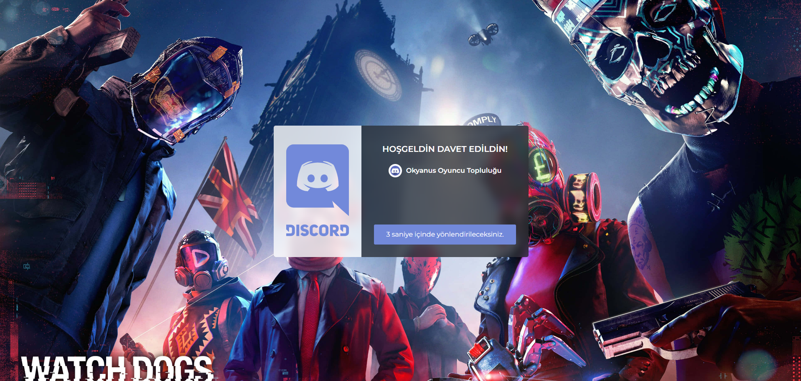

## Discord Davetiyesi Kişiselleştirme Bilgilendirme

Bu proje, Discord davetiyenizi `dc.domain.com` gibi özelleştirilmiş bir subdomain üzerinden yayınlamanızı sağlar. Aşağıdaki adımları takip ederek, gerekli ayarları kolayca yapabilirsiniz.

---

## 1. Subdomain Oluşturma

Öncelikle, `dc.domain.com` gibi bir subdomain oluşturmanız gerekmektedir.  
Bu işlemi domain sağlayıcınızın kontrol paneli üzerinden gerçekleştirebilirsiniz.

---

## 2. Kod Düzenlemeleri

- **index.html:**  
  Ana sayfa düzeni ve yapısını buradan düzenleyebilirsiniz.

- **script.js:**  
  Davetiye ile ilgili dinamik işlemleri ve JavaScript kodlarını buradan güncelleyebilirsiniz.

Yapacağınız bu düzenlemelerle, davetiyenizin görünümünü ve işlevselliğini özelleştirebilirsiniz.

---

Kurulum ve düzenleme işlemleri tamamlandığında, `dc.domain.com` adresi üzerinden Discord davetiyenize erişebilirsiniz.

İyi çalışmalar!

## Görüntü

